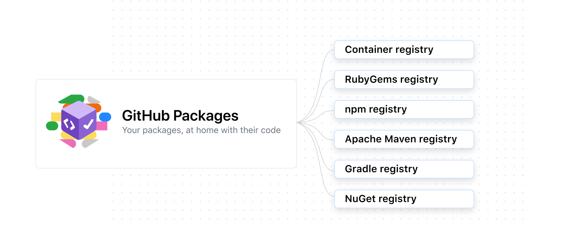

## NPM & GitHub Packages

GitHub Packages is a software package hosting service that allows you to host your software packages privately or publicly and use packages as dependencies in your projects.

GitHub Packages is available with GitHub Free, GitHub Pro, GitHub Free for organizations, GitHub Team, GitHub Enterprise Cloud, GitHub Enterprise Server 3.0 or higher, and GitHub AE. GitHub Packages is not available for private repositories owned by accounts using legacy per-repository plans

#### About GitHub Packages

GitHub Packages is a platform for hosting and managing packages, including containers and other dependencies. GitHub Packages combines your source code and packages in one place to provide integrated permissions management and billing, so you can centralize your software development on GitHub.

You can integrate GitHub Packages with GitHub APIs, GitHub Actions, and webhooks to create an end-to-end DevOps workflow that includes your code, CI, and deployment solutions. GitHub Packages offers different package registries for commonly used package managers, such as npm, Docker etc

